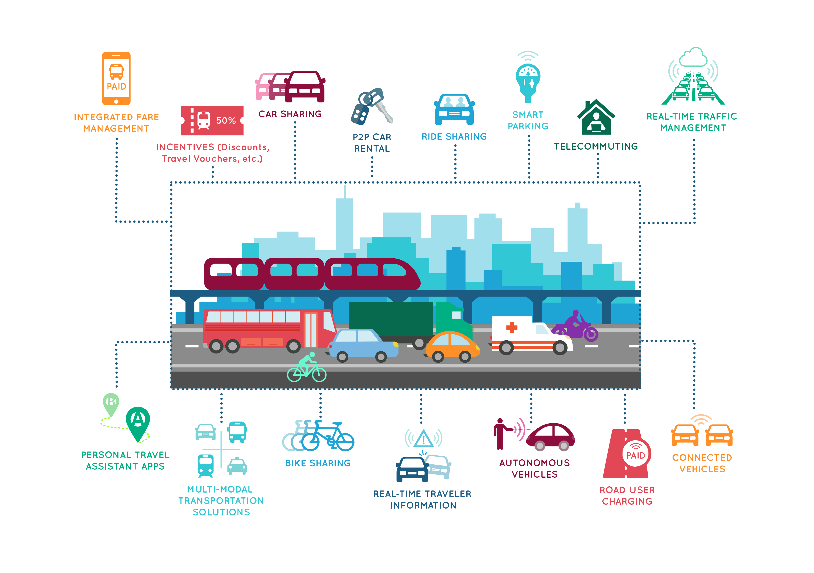

body {
    font: normal 10px Verdana, Arial, sans-serif;
}

# Research Aim:

<!---->

# RESEARCH INTEREST
-----

<table style="width:100%;font-size:14px;">
    <thead>
	<tr>
		<th width="25%">Highlight</th>
		<th width="25%">Topic</th>
		<th width="50%">Detail</th>
	</tr>
    </thead>
	<tbody>
		<tr id="interest1" class="entry">
		      <td>
			

			  
			  
Connected and Autonomous Vehicle

			

		      </td>
		      <td>Connected and Autonomous Vehicle</td>
		      <td>Intelligent vehicle technologies; Optimal and control method; Simulation and impacts analysis 
			       <!-- 
 [<a href="javascript:toggleInfo('interest1','abstract')">Abstract</a>]
				 [<a href="https://ieeexplore.ieee.org/abstract/document/8956222">PDF</a>] 
				  [<a href="http://tps.uwstarlab.org/">Website</a>]
			      
-->
		       </td>
		</tr>
		<tr id="interest2" class="entry">
			<td> pictures </td>
			<td> Big Data Analytics & Statistics </td>
			<td>Transportation safety data analysis; Discrete choice modeling; Machine learning and artificial intelligence.
		I am also highly interested in the developing data mining technology.
			</td>
		</tr>
		<tr id="interest2" class="entry">
			<td><pictures 
				</td>
			<td> Future Transportation Systems </td>
			<td>I am highly interested in technology which could change the future of the transportation. Including but not limited to: Intelligent transport control; Sharing mobility; Smart parking; Congestion mitigation..
			</td>
		</tr>
	</tbody>
</table>      

# METHODOLOGY
-----
<table style="width:100%">
    <thead>
		<tr>
			<th width="25%">Statement</th>
			<th width="50%">Topic</th>
			<th width="25%">Detail</th>
		</tr>
    </thead>
	<tbody>
	    <tr id="m1" class="entry">
		<td>In Developing</td>
	      <td>Car follwing model for intellegent vehicles.
		<!-- 
		

		  
		  

		  Connected and Autonomous Vehicle
		  
 
		
-->
	      </td>
		<td>paper1, paper2</td>
	</tr>
	<tr id="m2" class="entry">
		<td>In Developing</td>
		<td>Car pltooning technology for intelligent vehilces </td>
		<td>paper1, paper2</td>
	</tr>
	<tr id="m3" class="entry">
		<td>In Developing</td>
		<td>Random parameter discrete model </td>
		<td>paper1, paper2</td>
	</tr>
	<tr id="m4" class="entry">
		<td>Developed</td>
		<td>Discrete choice model: logit model (MNL, MXL; OL, PPO) </td>
		<td>Clustering: Latent class analysis/clustering</td>
	</tr>
	<tr id="m5" class="entry">
		<td>Developed</td>
		<td>Spatiotemporal analysis: Spatiotemporal cube analysis </td>
		<td>paper1, paper2</td>
	</tr>
	</tbody>
</table>        
